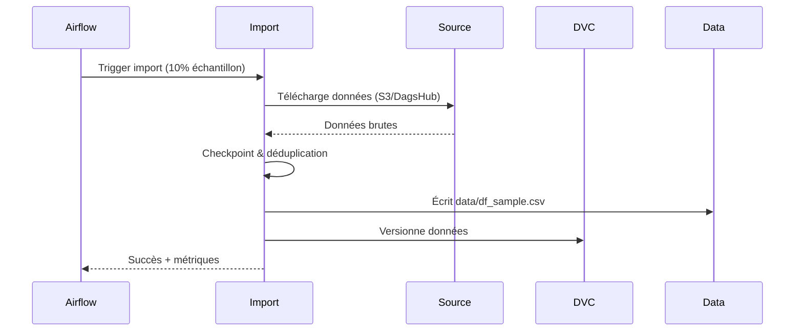
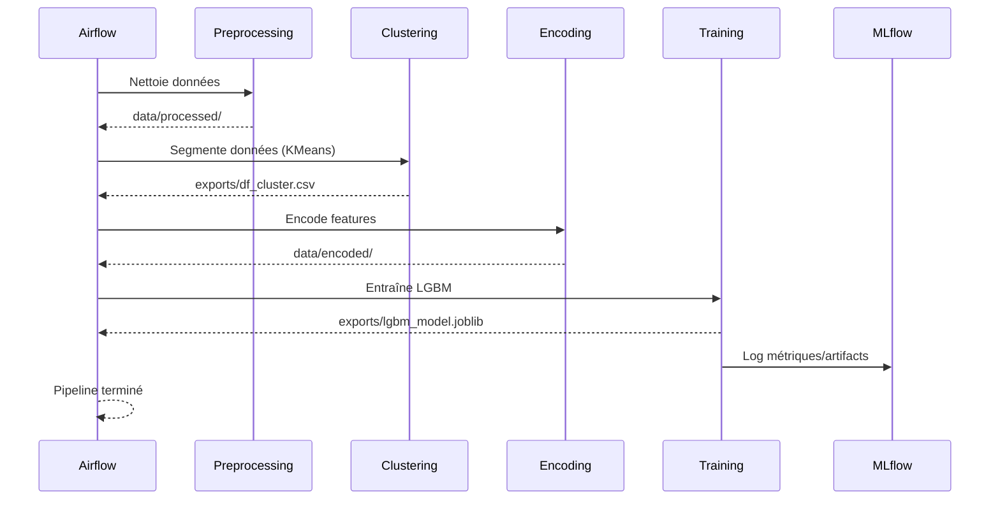
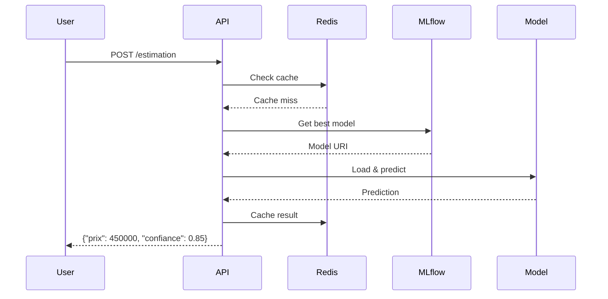

# Architecture du Projet Compagnon Immo

## Vue d'ensemble

Le projet Compagnon Immo est une plateforme MLOps complète pour la prédiction des prix immobiliers, composée de plusieurs services interconnectés orchestrés via Docker Compose et Airflow.

## Stack technologique

- **API**: FastAPI (serveur de prédictions)
- **Orchestration**: Airflow (pipelines MLOps)
- **Suivi ML**: MLflow (expériences et modèles)
- **Gestion données**: DVC (versionnement)
- **Base de données**: PostgreSQL + Redis
- **Monitoring**: Prometheus + Grafana
- **Conteneurisation**: Docker + Docker Compose

## Workflow visuel

```mermaid
graph TB
    %% Utilisateurs et interfaces externes
    subgraph "Utilisateurs"
        U[👤 Utilisateur]
        A[📊 Analystes]
        D[🔧 DevOps]
    end

    %% Services principaux
    subgraph "Services API"
        API[🚀 FastAPI API<br/>Port 8000]
        API -->|Routes| EST[📍 Estimation]
        API -->|Routes| HIST[📚 Historique]
        API -->|Routes| HEALTH[💚 Health]
        API -->|Routes| METRICS[📊 Métriques]
    end

    %% Orchestration Airflow
    subgraph "Orchestration Airflow"
        AF[🎯 Airflow<br/>Port 8081]
        AF -->|DAG| DAG[compagnon_immo_pipeline]
        DAG -->|Étapes| IMP[📥 Import données]
        DAG -->|Étapes| PREP[🧹 Preprocessing]
        DAG -->|Étapes| CLUS[🎯 Clustering]
        DAG -->|Étapes| ENC[🔢 Encoding]
        DAG -->|Étapes| TRAIN_LGBM[🌲 Train LGBM]
        DAG -->|Étapes| ANALYSE[📈 Analyse]
        DAG -->|Étapes| SPLIT_TS[✂️ Split TS]
        DAG -->|Étapes| DECOMP[📉 Décomposition]
        DAG -->|Étapes| SARIMAX[📊 SARIMAX]
        DAG -->|Étapes| EVAL[✅ Évaluation]
    end

    %% Services ML
    subgraph "Services ML"
        MLF[📈 MLflow<br/>Port 5050]
        DVC[📦 DVC<br/>Gestion données]
        REDIS[(🔴 Redis<br/>Cache)]
    end

    %% Base de données
    subgraph "Base de données"
        POSTGRES[(🐘 PostgreSQL<br/>Airflow)]
    end

    %% Monitoring
    subgraph "Monitoring"
        PROM[📊 Prometheus<br/>Port 9090]
        GRAF[📈 Grafana<br/>Port 3000]
    end

    %% Sources de données
    subgraph "Sources de données"
        S3[☁️ S3/DagsHub<br/>Données brutes]
        LOCAL[💾 Local<br/>Fichiers]
        HTTP[🌐 HTTP<br/>APIs externes]
    end

    %% Pipeline de données
    subgraph "Pipeline de données"
        DATA_RAW[📁 data/<br/>Données brutes]
        DATA_PROC[📁 data/processed<br/>Données traitées]
        EXPORTS[📁 exports/<br/>Modèles & artefacts]
        MLRUNS[📁 mlruns/<br/>Expériences MLflow]
    end

    %% Connexions principales
    U -->|Requêtes HTTP| API
    A -->|Interface web| AF
    A -->|Interface web| MLF
    D -->|Interface web| GRAF

    API -->|Cache| REDIS
    API -->|Logs métriques| MLF
    API -->|Pull modèles| DVC

    AF -->|Stockage métadonnées| POSTGRES
    AF -->|Logs expériences| MLF
    AF -->|Versionnement| DVC

    IMP -->|Import depuis| S3
    IMP -->|Import depuis| LOCAL
    IMP -->|Import depuis| HTTP

    PREP -->|Lit| DATA_RAW
    PREP -->|Écrit| DATA_PROC

    CLUS -->|Lit| DATA_PROC
    CLUS -->|Écrit| EXPORTS

    ENC -->|Lit| EXPORTS
    ENC -->|Écrit| DATA_PROC

    TRAIN_LGBM -->|Lit| DATA_PROC
    TRAIN_LGBM -->|Écrit modèles| EXPORTS
    TRAIN_LGBM -->|Logs| MLF

    ANALYSE -->|Évalue modèles| EXPORTS
    ANALYSE -->|Rapports| MLF

    SPLIT_TS -->|Prépare séries| DATA_PROC
    DECOMP -->|Décompose| EXPORTS
    SARIMAX -->|Prédit séries| EXPORTS
    EVAL -->|Évalue TS| EXPORTS

    %% Monitoring
    API -->|Métriques| PROM
    AF -->|Métriques| PROM
    PROM -->|Visualisation| GRAF

    %% Styles
    classDef apiClass fill:#e1f5fe,stroke:#01579b,stroke-width:2px
    classDef airflowClass fill:#f3e5f5,stroke:#4a148c,stroke-width:2px
    classDef mlClass fill:#e8f5e8,stroke:#1b5e20,stroke-width:2px
    classDef dataClass fill:#fff3e0,stroke:#e65100,stroke-width:2px
    classDef monitoringClass fill:#fce4ec,stroke:#880e4f,stroke-width:2px
    classDef externalClass fill:#f5f5f5,stroke:#424242,stroke-width:1px

    class API,EST,HIST,HEALTH,METRICS apiClass
    class AF,DAG,IMP,PREP,CLUS,ENC,TRAIN_LGBM,ANALYSE,SPLIT_TS,DECOMP,SARIMAX,EVAL airflowClass
    class MLF,DVC,REDIS mlClass
    class DATA_RAW,DATA_PROC,EXPORTS,MLRUNS dataClass
    class PROM,GRAF monitoringClass
    class U,A,D,S3,LOCAL,HTTP,POSTGRES externalClass
```



## Flux de données détaillé

### 1. Ingestion des données


### 2. Pipeline ML complet


### 3. Service de prédiction


## Points d'entrée et ports

| Service | Port | Description |
|---------|------|-------------|
| FastAPI API | 8000 | API de prédiction principale |
| Airflow Webserver | 8081 | Interface d'orchestration |
| MLflow UI | 5050 | Suivi des expériences ML |
| Prometheus | 9090 | Métriques système |
| Grafana | 3000 | Dashboards de monitoring |
| Redis | 6379 | Cache en mémoire |

## Volumes et persistance

- `postgres_data`: Métadonnées Airflow
- `mlflow_artifacts`: Modèles et artefacts MLflow
- `./data`: Données brutes et traitées
- `./exports`: Modèles entraînés
- `./mlruns`: Expériences MLflow locales

## Sécurité et authentification

- API Key pour les endpoints d'estimation
- Variables d'environnement pour credentials AWS/DagsHub
- Réseau isolé `ml_net` entre services
- Middleware CORS et sécurité sur l'API

## Déploiement

### Développement
```bash
docker-compose -f docker-compose.yml up --build
```

### Production
```bash
docker-compose -f docker-compose.prod.yml up --build
```

### Services optionnels
- `--profile monitoring`: Prometheus + Grafana
- `--profile test`: Tests automatisés
- `--profile ci`: Intégration continue

Cette architecture permet une séparation claire des responsabilités, une scalabilité horizontale et un suivi complet du cycle de vie des modèles ML.
