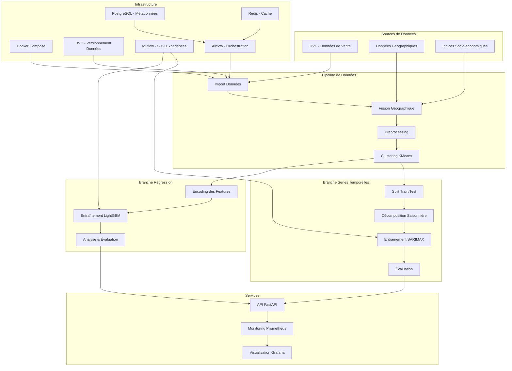
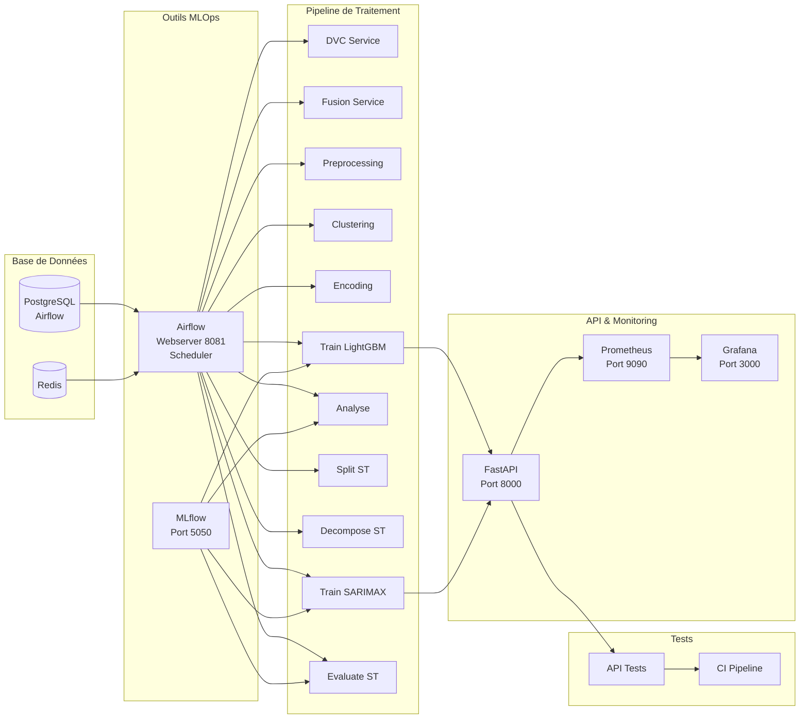
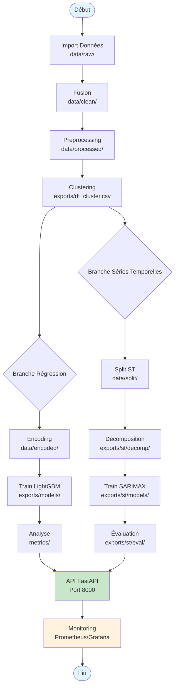

# Architecture Générale du Pipeline MLOps - Prédiction des Prix Immobiliers

## Vue d'ensemble du Workflow

Ce projet utilise une architecture MLOps complète pour prédire les prix immobiliers avec deux approches :
- **Modélisation par régression** (LightGBM) : prédiction basée sur les caractéristiques du bien
- **Modélisation par séries temporelles** (SARIMAX) : prédiction basée sur l'évolution temporelle des prix

## Détail du Workflow Étape par Étape

### 1. **Import des Données** (DVC)
- Récupération des données depuis Dagshub/S3
- Gestion des données incrémentales avec checkpoints
- Stockage dans `data/`

### 2. **Fusion Géographique**
- Jointure des données DVF avec les contours postaux
- Enrichissement avec les indices socio-économiques
- Résultat : `data/clean/df_sales_clean.csv`

### 3. **Preprocessing**
- Nettoyage des données (valeurs manquantes, outliers)
- Normalisation et transformation des features
- Séparation train/test
- Sortie : `data/processed/`

### 4. **Clustering**
- Segmentation des données en clusters avec KMeans
- Basé sur les caractéristiques géographiques et économiques
- Préparation pour les modèles spécialisés par cluster

### 5. **Branche Régression**
#### 5.1 Encoding
- Transformation des variables catégorielles
- Normalisation des features numériques
- Sauvegarde des mappings d'encodage

#### 5.2 Entraînement LightGBM
- Modèle de régression par gradient boosting
- Optimisation des hyperparamètres
- Suivi des métriques dans MLflow

#### 5.3 Analyse
- Évaluation sur le jeu de test
- Calcul des métriques (MAE, RMSE, R²)
- Analyse de l'importance des features

### 6. **Branche Séries Temporelles**
#### 6.1 Split
- Division temporelle train/test par cluster
- Préparation des séries chronologiques

#### 6.2 Décomposition
- Analyse saisonnière additive/multiplicative
- Identification des tendances et cycles

#### 6.3 Entraînement SARIMAX
- Modélisation ARIMA avec variables exogènes
- Recherche des meilleurs paramètres par cluster
- Validation croisée temporelle

#### 6.4 Évaluation
- Prédictions sur la période de test
- Calcul des métriques de précision

### 7. **API FastAPI**
- Endpoint `/api/v1/estimation` pour les prédictions
- Support de deux formats de payload (simple/complet)
- Authentification par API key
- Health checks et métriques

### 8. **Monitoring**
- Prometheus pour la collecte de métriques
- Grafana pour les tableaux de bord
- Suivi des performances de l'API

## Architecture des Services Docker

## Flux de Données

## Profils Docker Compose

Le projet utilise différents profils pour lancer des sous-ensembles de services :

- **`regression`** : Services pour la modélisation par régression (MLflow, API, tests)
- **`series`** : Services pour les séries temporelles
- **`airflow`** : Orchestration complète avec Airflow
- **`monitoring`** : Prometheus et Grafana
- **`dvc`** : Outils de gestion des données
- **`test`** : Tests automatisés
- **`ci`** : Pipeline d'intégration continue

## Points d'Accès

- **API FastAPI** : http://localhost:8000
  - Documentation : http://localhost:8000/docs
  - Health check : http://localhost:8000/api/v1/health

- **MLflow** : http://localhost:5050
  - Interface de suivi des expériences

- **Airflow** : http://localhost:8081
  - Interface d'orchestration des pipelines

- **Grafana** : http://localhost:3000
  - Tableaux de bord de monitoring (admin/admin)

- **Prometheus** : http://localhost:9090
  - Métriques système

Cette architecture permet une séparation claire des responsabilités, une reproductibilité grâce à Docker, et un suivi complet des expériences avec MLflow et DVC.
